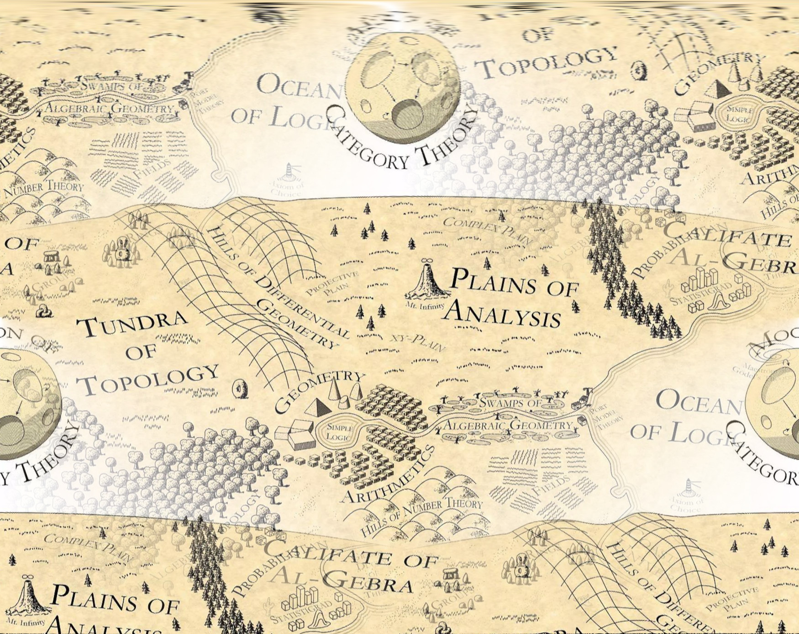
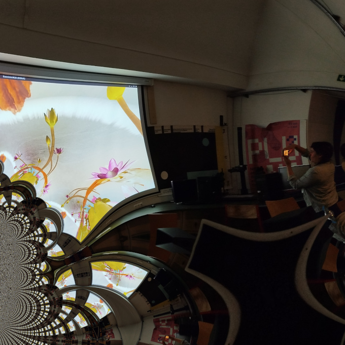

# Realidades-Virtual-e-Aumentada-fbaul2425
Secção da UC Realidades Virtual e Aumentada dedicada à realidade virtual. FBAUL 2024-25

Secção ensinada e orientada por [André Sier](https://andre-sier.com).

# Licença

Materiais do curso fornecidos aos alunos de mestrado da UC ```Realidades Virtual e Aumentada``` na licença MIT. Materiais do curso disponibilizadas publicamente a qualquer outra pessoa sem ter sido aluno da UC neste ano lectivo na licença CC-BY-NC-ND.



# Virtual-and-Augmented-Realities-fbaul2425

UC ```Virtual and Augmented Realities``` section dedicated to virtual reality. FBAUL 2024-25 

Section taught and guided by [André Sier](https://andre-sier.com).

# License

Course materials provided to UC Master's students "Virtual and Augmented Realities" under the MIT license. Course materials made publicly available to anyone else without having been a UC student this academic year on the CC-BY-NC-ND license.


